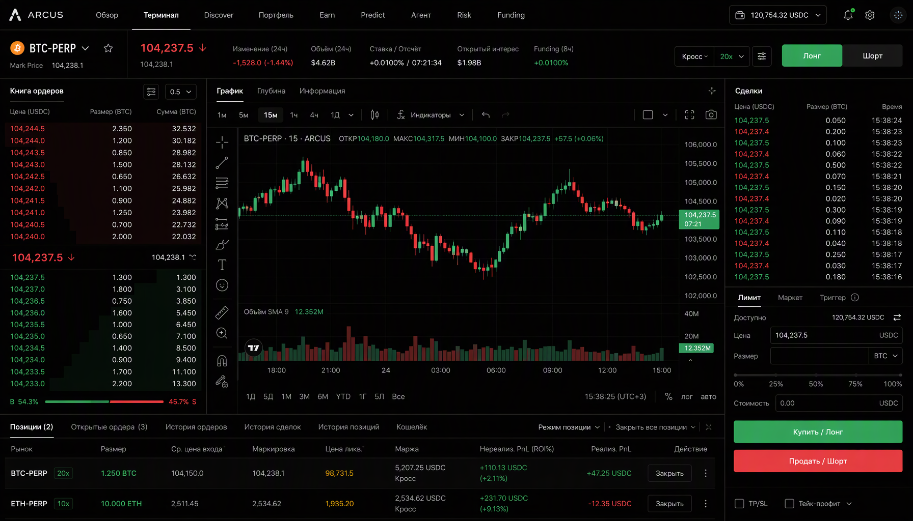
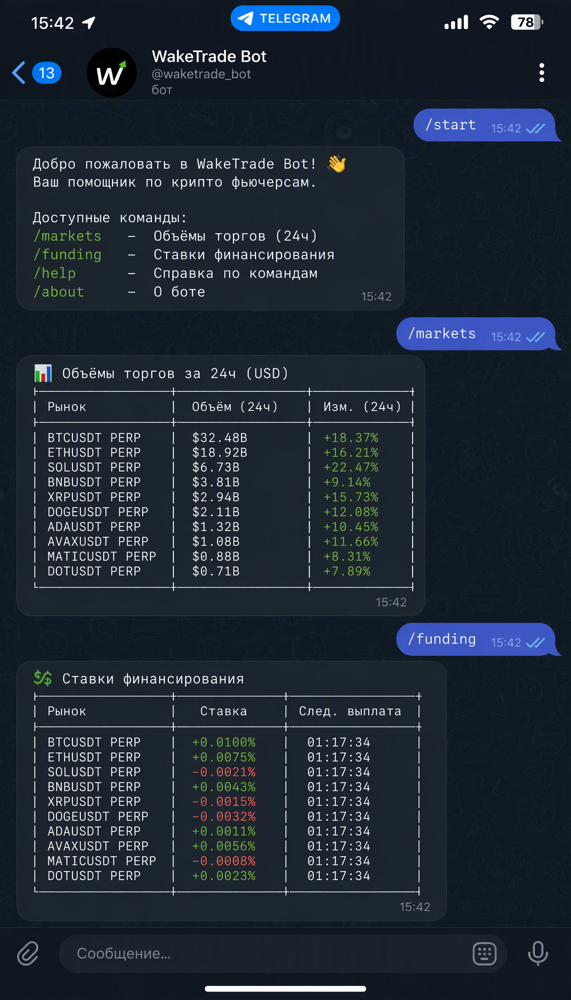

# Wake

Торговый терминал для [Lighter](https://lighter.xyz) (zk perp DEX): React-приложение, FastAPI-бэкенд и Telegram-бот с Mini App — бот и сайт читают и пишут в один и тот же бэкенд.

Конфигурация по умолчанию — **mainnet** и `WAKE_DRY_RUN=true`: настоящие рыночные данные из реальной сети, и ни один ордер не выходит из процесса, пока вы сами не выключите dry-run.

Живой фронтенд: https://wake-7k6.pages.dev  
Живой бэкенд: https://wake-backend-production-3483.up.railway.app

## Скриншоты

### Веб-терминал



### Telegram-бот



## Контакты

- **Telegram:** [@ssrjkk](https://t.me/ssrjkk)
- **GitHub:** [@ssrjkk](https://github.com/ssrjkk)

## Что делает каждая панель

| Панель | Откуда данные | Работает без бэкенда Wake |
| --- | --- | --- |
| Обзор | Ранжирование рынков по настоящему $-обороту за 24ч (`/markets/overview`, 18 перпов, кэш 60 секунд) плюс открытые рынки Predict | нет |
| Терминал | Стакан, свечи и лента сделок из публичного REST Lighter | чтение да; отправка ордера требует signing service |
| Discover | Лидеры по числу подписчиков и AUM, подписка / пауза / отписка | нет |
| Портфель | Ваши позиции на Lighter по L1-адресу (публичный REST); подписки и журнал копи-движка — из бэкенда | позиции да, состояние копи-трейдинга нет |
| Earn | Состояние подписки на копи-трейдинг и активация триала | нет |
| Predict | LMSR-рынки цен и событий: создание, котировка, резолюция, выплаты | нет |
| Агент | Решение по рынку с памятью винрейта именно на этом рынке | нет |
| Risk | Кросс-ассетная экспозиция и расчёт хеджа | нет |
| Funding | Ставка funding Lighter рядом с Binance, Bybit и Hyperliquid для одного и того же `market_id` (все четыре приходят из lighter-овского `/funding-rates`), годовая — из 24 эпох в сутки | ставки да; проверка арбитража и расчёт размера идут в бэкенд |

Три панели работают вообще без бэкенда — поэтому сайт не пустеет, когда бэкенд не поднят. Смотрите [src/lib/backend.ts](src/lib/backend.ts).

## Подключение

Два пути идентичности, оба попадают в одну запись follower:

**Telegram.** Кнопка Login Widget рисуется, только если фронтенд собран с `VITE_TELEGRAM_BOT_NAME` (имя бота без `@`), а бэкенд запущен с `TELEGRAM_BOT_TOKEN`. Бэкенд пересобирает check-строку виджета и сравнивает HMAC (`POST /auth/telegram`), а `initData` мини-аппа проверяет отдельно (`POST /auth/telegram/init`). Без токена панель прямо говорит, что вход через Telegram выключен, вместо кнопки, которая ответит 401.

**Кошелёк.** Injected-кошельки (MetaMask, Rabby) работают без всякой настройки; QR-коннектор WalletConnect требует `VITE_WALLETCONNECT_PROJECT_ID`. Подключённый L1-адрес регистрируется как follower (`POST /followers`), позиции читаются с Lighter по этому адресу.

## Быстрый старт

### Фронтенд

```bash
npm install
cp .env.example .env    # необязательно: дефолты — mainnet + локальные сервисы
npm run dev             # http://localhost:5173
```

### Бэкенд

```bash
cd backend
pip install -r requirements.txt
cp .env.example .env
uvicorn app:app --reload --port 8000
```

Swagger UI — `http://localhost:8000/docs`, машиночитаемая схема (37 путей) — `/openapi.json`. Запускать нужно из `backend/`: пути к SQLite считаются от рабочей директории, поэтому запуск из корня репозитория молча создаёт вторую базу.

### Копи-трейдинг без сид-скрипта

Скрипта с демо-лидерами нет. Лидера и подписчика регистрируют через API:

```bash
curl -X POST http://localhost:8000/leaders \
  -H 'Content-Type: application/json' \
  -d '{"lighter_account_index": 12345, "handle": "your-handle", "fee_bps": 8}'

curl -X POST http://localhost:8000/followers \
  -H 'Content-Type: application/json' \
  -d '{"l1_address": "0xYourAddress"}'

curl -X POST http://localhost:8000/follows \
  -H 'Content-Type: application/json' \
  -d '{"follower_id": "0xYourAddress", "leader_id": "<leader_id>", "allocation_usd": 500, "max_leverage": 3}'
```

Листенер, который превращает изменения позиции лидера в ордера подписчиков, запускается на каждого лидера:

```bash
cd backend
python leader_listener.py --leader-id <leader_id> --account-index 12345
```

С `WAKE_DRY_RUN=true` он пишет план зеркалирования в лог и ничего не подписывает.

### Signing service

```bash
cd backend
uvicorn signing_service:app --port 8787
```

Нужны `LIGHTER_ACCOUNT_INDEX`, `LIGHTER_API_KEY_INDEX` и `LIGHTER_API_KEY_PRIVATE_KEY` (api key с app.lighter.xyz — не приватный ключ кошелька). Терминал шлёт ордера именно сюда, а не в бэкенд.

### Telegram-бот и Mini App

```bash
cd backend
python telegram_bot.py     # берёт TELEGRAM_BOT_TOKEN из окружения
```

Команды: `/start`, `/help`, `/price BTC`, `/markets`, `/funding`, `/predict`, `/predict resolved`. Ответы бота приходят из тех же эндпоинтов, что и сайт (`/markets/overview`, `/funding/rates`, `/predict/markets`), поэтому расходиться им нечем. `WAKE_MINIAPP_URL` — адрес, который открывает кнопка «Открыть Wake»; Telegram требует https.

### Резолвер Predict

```bash
cd backend
python predict_resolver.py --loop     # один тик без --loop
```

Price-рынки закрываются по дедлайну только пока этот процесс работает; иначе резолюция остаётся ручным триггером куратора. Интервал — `WAKE_PREDICT_RESOLVER_TICK` (по умолчанию 300 секунд).

## Конфигурация

### Фронтенд (`.env`, Vite читает его при сборке)

| Переменная | Дефолт | Зачем |
| --- | --- | --- |
| `VITE_LIGHTER_NETWORK` | `mainnet` | должна совпадать с `WAKE_LIGHTER_NETWORK` бэкенда, иначе сайт и бот покажут разные market id |
| `VITE_BACKEND_URL` | Railway URL | зашивается в бандл, в рантайме не меняется; для локальной разработки задайте `http://localhost:8000` в `.env` |
| `VITE_SIGNING_SERVICE_URL` | `http://localhost:8787` | |
| `VITE_WALLETCONNECT_PROJECT_ID` | пусто | без него нет QR-коннектора; injected-кошельки работают и так |
| `VITE_TELEGRAM_BOT_NAME` | пусто | пусто — панель входа через Telegram выключена |
| `VITE_SENTRY_DSN` | пусто | держать пустым, пока проект реально не подключён |

### Бэкенд (`backend/.env`)

Все переменные с их кодовыми дефолтами описаны в [backend/.env.example](backend/.env.example). Те, что меняют поведение:

| Переменная | Дефолт | На что влияет |
| --- | --- | --- |
| `WAKE_LIGHTER_NETWORK` | `mainnet` | из имени сети берутся REST-хост, WS-хост и market ids — вместе |
| `WAKE_DRY_RUN` | `true` | `false` означает живые ордера на реальные деньги |
| `WAKE_CORS_ORIGINS` | `http://localhost:5173` | список фронтендов через запятую |
| `WAKE_CURATOR_TOKEN` | пусто | пусто — кураторские эндпоинты отвечают 500; неверный `X-Curator-Token` — 403 |
| `TELEGRAM_BOT_TOKEN` | пусто | процесс бота и проверка подписи Telegram-входа |
| `WAKE_MASTER_KEY` | пусто | шифрует хранилище ключей; хранить в секрет-менеджере, не на диске |
| `WAKE_DB_PATH` / `WAKE_AUDIT_DB_PATH` | `wake.db` / `audit.db` | два отдельных файла SQLite |
| `WAKE_RATE_LIMIT_CAPACITY` / `WAKE_RATE_LIMIT_REFILL` | 40 / 20 | token bucket на клиента |
| `ANTHROPIC_API_KEY` | пусто | только LLM-путь решений; без ключа агент работает на rule-движке |

## Тесты

```bash
# бэкенд — из backend/
python -m unittest discover          # 210 тестов
python test_db.py
python test_predict_db.py
python test_predict_integration.py
python test_audit_log.py             # эти четыре — отдельные скрипты, discover их не собирает

# фронтенд
npx tsc --noEmit
npx vitest run                       # 61 тест в 8 файлах
npm run build

# end-to-end (поднимает свой dev-сервер; PW_PORT спасает, когда 5173 занят)
PW_PORT=5178 npx playwright test     # 6 тестов, chromium
```

`test_api_smoke.py` проходит по всем роутам поверх HTTP, поэтому незаимпортированный роутер или эндпоинт, который отдаёт 500, падает в CI, а не под первым кликом.

## Архитектура

### Бэкенд (FastAPI)

- `backend/app.py` — приложение, middleware (CORS, rate limiting по IP клиента, опциональный Sentry), регистрация роутеров, `/health`
- `backend/api/` — HTTP-роутеры по продуктовых областям:
  - `auth.py` — проверка подписи Login Widget и `initData` мини-аппа
  - `markets.py` — `/markets/overview`: ранжирование перпов по 24ч-обороту
  - `copy_trading.py` — followers, leaders, follows, журнал зеркалирования
  - `predict.py` — рынки цен и событий, резолюция под токеном куратора
  - `agent.py` — решения, память, подписки
  - `portfolio.py` — кросс-ассетный риск и хедж
  - `funding.py` — сравнение площадок и расчёты carry
- Ядро логики — в корневых модулях, и тестируется отдельно: `mirror_engine.py`, `leader_position_tracker.py`, `predict_amm.py`, `predict_resolution.py`, `portfolio_risk.py`, `funding_arb.py`, `agent_decision.py`, `agent_memory.py`, `risk_limits.py`, `rate_limiter.py`, `cache.py`, `db.py`, `predict_db.py`, `audit_log.py`
- Конфигурация читается один раз — `backend/config.py`

### Фронтенд (React + TypeScript + Vite + Tailwind + wagmi)

- `src/App.tsx` — оболочка табов, состояние подключения, пробивка здоровья бэкенда
- `src/components/` — по файлу на панель
- `src/lib/backend.ts` — единственное место, откуда идут запросы в бэкенд Wake; каждое сообщение об ошибке на панели рождается здесь
- `src/lib/lighter.ts` — клиент публичного REST Lighter
- `src/lib/predict.ts`, `src/lib/telegram.ts`, `src/lib/leaders.ts`, `src/lib/config.ts`

## Деплой

### Фронтенд: Cloudflare Pages (именно он и работает)

Проект `wake` → https://wake-7k6.pages.dev.

- команда сборки `npm run build`, выходная директория `dist`, Node 24
- переменные `VITE_*` задаются как build-ENV: они компилируются в бандл, значит смена одной из них требует пересборки
- `public/_redirects` содержит `/* /index.html 200`, чтобы глубокие ссылки SPA открывались

Важное следствие: Pages отвечает `index.html` со статусом 200 на **любой** неизвестный путь, поэтому запрос к API на хост без бэкенда возвращает HTML. `src/lib/backend.ts` превращает это в читаемое «по этому адресу бэкенда Wake нет» вместо SyntaxError, и панели печатают, какие три продолжают работать.

Деплой из репозитория:

```bash
npm run build
npx wrangler pages deploy dist --project-name wake
```

### Бэкенд: Railway (именно он и работает)

Бэкенд работает на Railway через Docker (`Dockerfile` в корне репо, `railway.json` настраивает сборку). Переменные окружения задаются через дашборд Railway или CLI.

```bash
railway variables set WAKE_DRY_RUN=true WAKE_LIGHTER_NETWORK=mainnet
railway variables set WAKE_CORS_ORIGINS="https://wake-7k6.pages.dev"
railway service redeploy --service wake-backend
```

Полная инструкция — в [RAILWAY_DEPLOY.md](RAILWAY_DEPLOY.md).

**Альтернатива: Docker Compose (локально или на своём хостинге)**

```bash
docker compose up app              # :8000
docker compose up signing          # :8787
docker compose up telegram-bot     # нужен TELEGRAM_BOT_TOKEN
docker compose up predict-resolver
```

Базы лежат в volume `wake-data` и переживают рестарт контейнера; секреты берутся из `backend/.env`, который `docker-compose.yml` читает, но не требует.

## Что не сделано — прямо

- `fee_bps` лидера проверяется (0–500) и сохраняется, но никогда не списывается: пути выплат нет.
- Никаких платежей. Тарифы и триалы (`backend/subscription.py`) существуют только как состояние.
- Память агента, подписки и состояние риска в `backend/api/agent.py` живут в словарях процесса и теряются при рестарте. Данные копи-трейдинга и Predict — в SQLite; агент — нет.
- LLM-путь решений (`backend/llm_agent.py`) не покрыт тестами. При ошибке вызова или отсутствующем ключе он откатывается на протестированный rule-движок.
- WebSocket-соединение в `leader_listener.py` автотестами не проверяется (логику сравнения снапшотов позиций — проверяют): нужна реальная сеть.
- SQLite для локальной разработки и данных копи-трейдинга/Predict; PostgreSQL доступен для продакшена (см. `backend/database.py`, `backend/pg_models.py`, `alembic/`). Память агента и подписки живут в словаре процесса и теряются при рестарте.
- `handle` лидера — то, что ввёл регистрирующийся; соответствие реальному аккаунту Lighter не сверяется.
- `/markets/overview` стоит 18 свечных запросов на обновление и кэшируется 60 секунд.

## Безопасность

- Секреты только из переменных окружения; `backend/.env` в .gitignore, как и `wake.db`, `audit.db`, `*.enc` и dev-хранилища ключей.
- `WAKE_DRY_RUN` по умолчанию `true`; размеры ордеров всегда округляются вниз.
- Кураторские эндпоинты требуют заголовок `X-Curator-Token` и сравнивают его через `hmac.compare_digest`; если токен на сервере не задан, эндпоинты остаются закрытыми, а не создают и не резолвят рынки анонимно.
- SQL везде параметризованный; CORS и rate limit настраиваются переменными окружения.
- Ключи шифруются at rest (`encrypted_key_store.py`, есть режим KMS) — это шифрование, а не HSM.

Для работы с реальными средствами: внешний аудит безопасности, замена файлового хранилища ключей на HSM/KMS и юридическая консультация по вашей юрисдикции. Об уязвимостях сообщать приватно — через security advisory GitHub, а не публичным issue.

## Документация

- [README.md](README.md) — английская версия
- [CONTRIBUTING.md](CONTRIBUTING.md)
- [LICENSE](LICENSE) — MIT

## Лицензия

MIT — см. [LICENSE](LICENSE).
